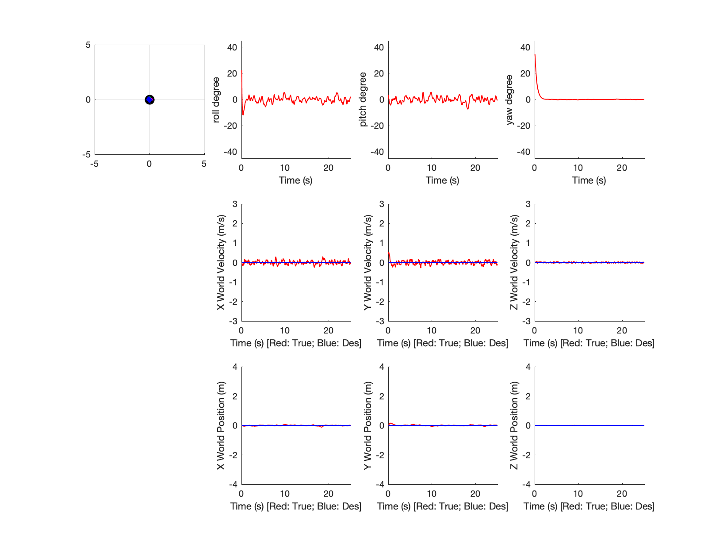
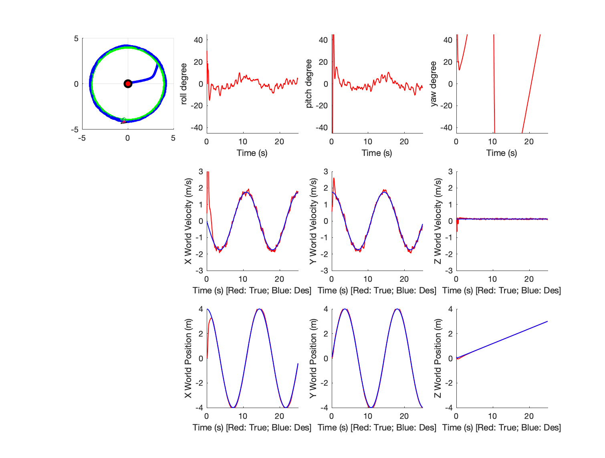
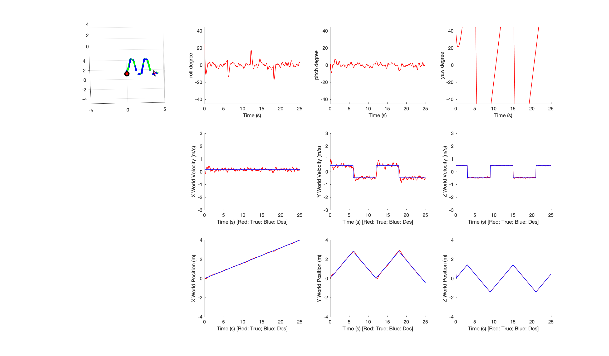

## Proj1 Phase1 Report

### Xinjie Yao 20327521

#### Figures 

|  |  |  |
| :------------------------------------: | :----------------------------------: | :-----------------------------------: |
|                Hovering                |                Circle                |                Diamond                |

#### Statistics about your controller

|      | position_x | position_y | position_z | roll | pitch | yaw  |
| ---- | ---------- | ---------- | ---------- | ---- | ----- | ---- |
| $kp$ | 7          | 7          | 50         | 1000 | 1000  | 100  |
| $kd$ | 4          | 4          | 80         | 98   | 98    | 49   |

| RMSE     | $x$    | $y$    | $z$    | $v_x$  | $v_y$  | $v_z$  | $\omega_\phi$ | $\omega_\theta$ | $\omega_\psi$ |
| -------- | ------ | ------ | ------ | ------ | ------ | ------ | ------------- | --------------- | ------------- |
| hovering | 0.0279 | 0.0364 | 0.0019 | 0.0923 | 0.1145 | 0.0201 | 0.3793        | 0.3768          | 0.1390        |
| circle   | 0.4587 | 0.0887 | 0.0253 | 0.9236 | 0.1621 | 0.0510 | 1.3495        | 1.2493          | 0.3570        |
| diamond  | 0.0341 | 0.0579 | 0.0061 | 0.1043 | 0.1855 | 0.0452 | 0.3931        | 0.5109          | 0.6228        |

####Analysis of your result

The overall performance is acceptable given the balance between overshoot and high frequency oscillation. The quadrotor approximately follows the generated trajectory as the x,y,z positions allign with the desired state. However, the linear and angular velocity tend to have a relative larger deviation from the desired state, which may affect the perception accuracy given the rotation behavior. Since the model is added with Gaussian noise as external disturbance, it is impossible to have desired angular velocity as 0; Notice that the parameters $kp$ and $kd$ is relativly large, a slight difference(i.e. single-digit variation) yields to the unwanted performance dramaticlly.

As I would say, the tuning process suffered from the coupling effect of positions and angles. For example, the roll angle has the similar behavior as the y velocity. I choose to tune the yaw angle and x,y,z position in the begining. Until the oscillation, increase Kd. But then the overshoot demonstrated by roll/pitch can't be cancelled out untill larger magitude of kp and kd were assigned. 

#### Any other things we should be aware of

In my implementation of attutide control, I didn't choose to take the derivative of $(\phi_c-\phi)$, $(\theta_c-\theta)$,$(\psi_c-\psi)$ as the ultimate goal is to elimate the angular velocity such that better  vision quality could be ensured. Instead, I use the angular velocity provided in the desired state $s_{des}$ which are set to 0 in the config. The performance tends to fall when the period of the diamond trajectory decreases a lot. It is reasonable that the system could not respond quickly enough to large $v_y$, $v_z$. 

