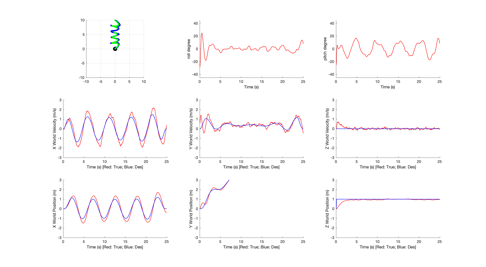
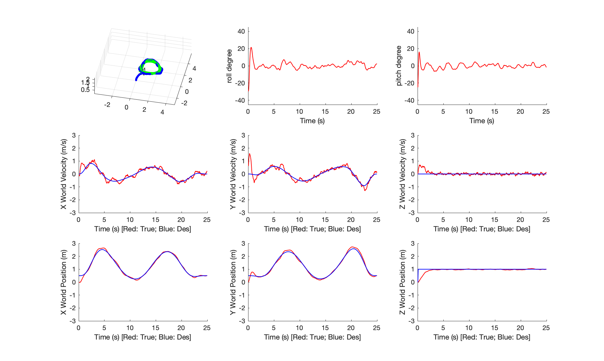
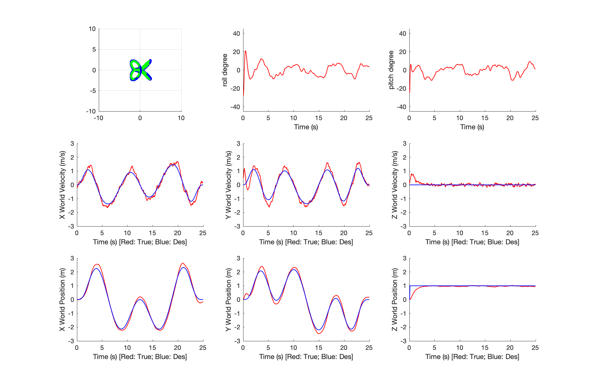
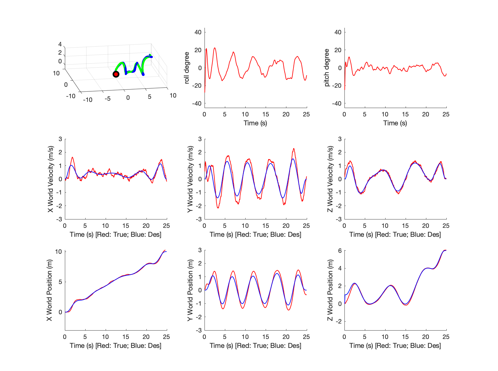

## Proj1 Phase2 Report

### Xinjie Yao 20327521

#### Figures 

| Path1 | Path2 |
| :---------------------------: | :---------------------------: |
| Path3 | Path4 |

#### Statistics about your controller

| RMSE  | $x$    | $y$    | $z$    | $v_x$  | $v_y$  | $v_z$  | $\omega_\phi$ | $\omega_\theta$ | $\omega_\psi$ |
| ----- | ------ | ------ | ------ | ------ | ------ | ------ | ------------- | --------------- | ------------- |
| Path1 | 0.2750 | 0.1404 | 0.1767 | 0.3912 | 0.2963 | 0.1440 | 0.3999        | 0.3359          | 0.2878        |
| Path2 | 0.2234 | 0.2293 | 0.1873 | 0.3548 | 0.4625 | 0.1475 | 0.4086        | 0.3693          | 0.3071        |
| Path3 | 0.1767 | 0.1920 | 0.1674 | 0.1962 | 0.2714 | 0.1524 | 0.3674        | 0.2666          | 0.2864        |
| Path4 | 0.1009 | 0.2946 | 0.2098 | 0.1889 | 0.4550 | 0.1647 | 0.4297        | 0.2625          | 0.2878        |

#### Analysis of your results 

In general, the controller could follow different trajectories when time intervals between waypoints are not too short. Since ths controller can't respond to instant changes in states, the time interval is set to spread out the total 25 seconds. Such that the quadrotor could follow the planned trajectory without blowing out. 

#### Any other things we should be aware of

The method of minimum snap trajectory generator is implemented here using constrained QP. The continuity and derivative constraints are imposed up to the jerk level, instead of the snap level as the snap may not be continous. 