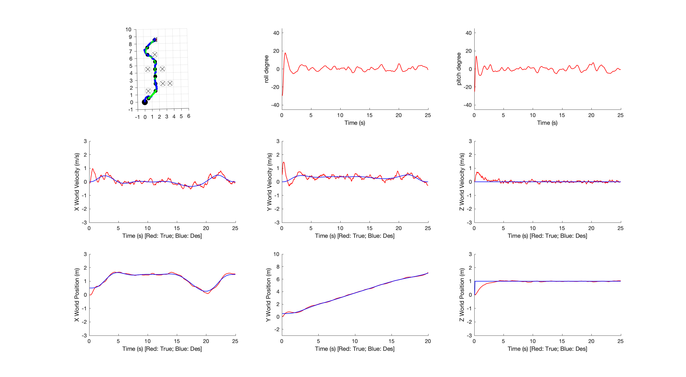
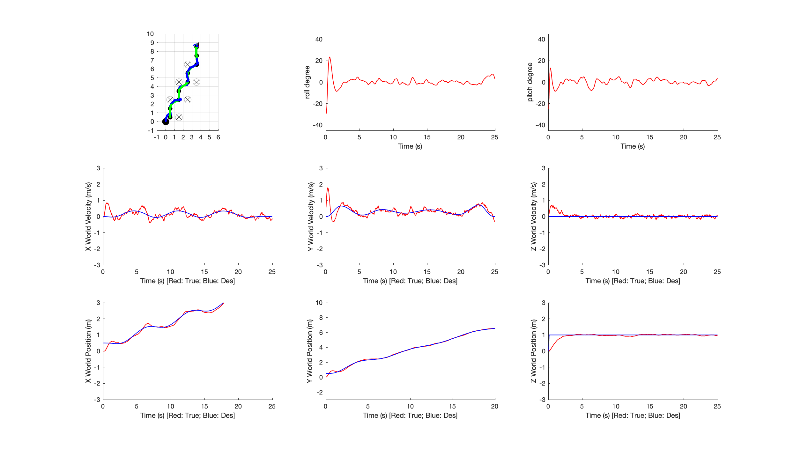
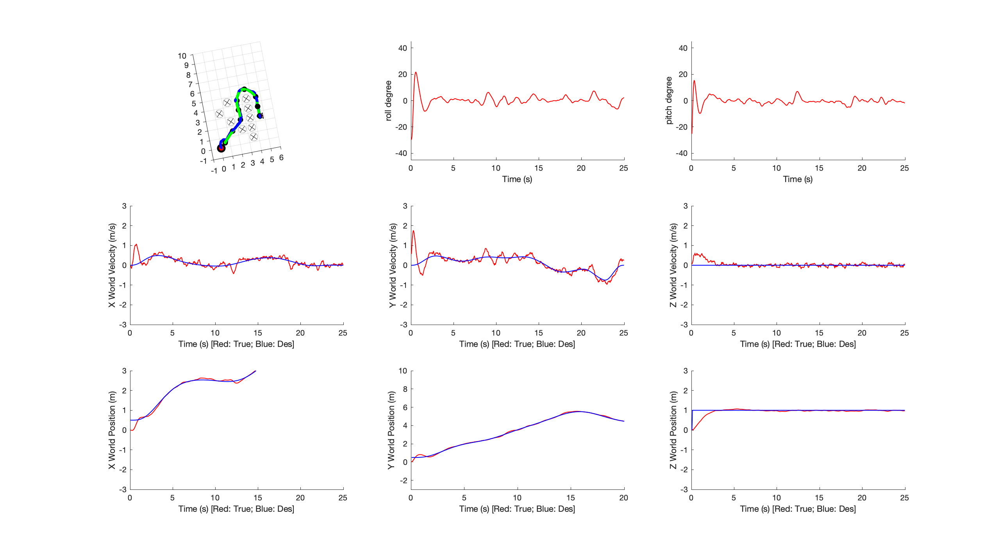
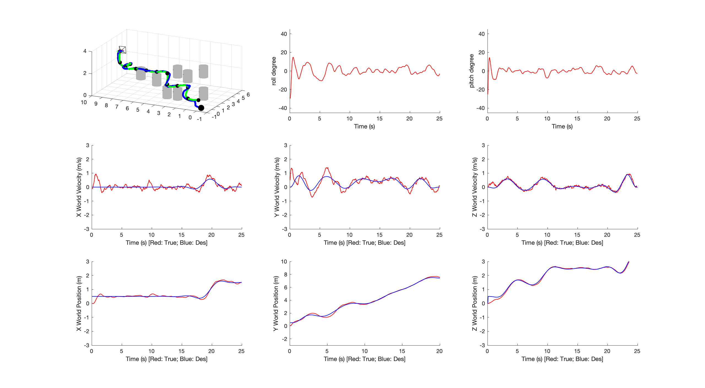

## Proj1 Phase3 Report

### Xinjie Yao 20327521

#### Figures 

|  Map1—2d  |   Map2—2d    |
| :------------------------------: | :---------------------------------: |
| Map3 — 2d | Map4 — 3d |

#### 

#### Analysis of your results 

To test the script in 2D, please envoke the call of **__Optimal_path = path_from_A_star(test_map);__**

To test the script in 2D, please envoke the call of **__Optimal_path = path_from_A_star_3d(test_map);__**

For the 2D case, 8-connected neighbours are chosen to reach to the goal point faster. As the planning context is not C-space(or at least how I implemented), the obstacles and quadrotor are considered as the point mass. In the visualization, the obstacles are placed within the grid while the creation of map assumes obstacles are placed at intersections. In order to accomodate this design and not collide into the obstacles, the computed waypoints are adpoted to offset by -0.5.

For the 3D case, 6-connected neighbours are selected given the condition that the minimum snap trajectory planner often leads to collision when it comes to the elevating path (change in Z direction). The waypoints are generated at least to elliminate collision into those obstacle point mass(located at the center) and minimize intersection with the   cylinder in the visualization. Note that the plotting method is modified to ensure the height of the cylinder resides with a range. The computed waypoints are also offsetted by -0.5 among three dimensions. 

The printed out points are optimal waypoints before offset . 

#### Any other things we should be aware of

Since the method assumes objects are point mass, there is no phsycial constriants taking into considerations. You may notice that sometimes the placement of obstacles may result in higher chance of collision between the trajectory and obstacles. Potentially it could be solved by inflating the obstacles through more obstacles points, decreasing the grid to set more intermediate waypoints, or solving physical constraints in the trajectory generator as corridors. 