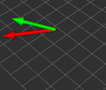
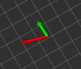
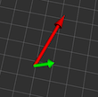
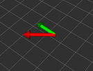

## Proj2 Phase1 Report  Xinjie Yao 20327521

| opencv-simple  | opencv-difficult |
| :----------------------------------------------------------- | ------------------------------------------------------------ |
| PyramidLK-simple | Pyramid-difficult |

#### Analysis of your results 

| Per Frame | RMSE $V_x$ Simple | RMSE $V_y$ Simple | RMSE $V_x$ Hard | RMSE $V_y $    Hard |
| --------- | ----------------- | ----------------- | --------------- | :------------------ |
| OpenCV    | 0.008822          | 0.008777          | 0.014929        | 0.015365            |
| PyramidLK | 0.015797          | 0.0143062         | 0.0275103       | 0.0161823           |

To test option OpenCV, please envoke the call of `rosrun optical_flow optical_flow`

To test option PyramidLK, please envoke the call of `rosrun optical_flow optical_flow_src`

#### Implementations

###### OpenCV

For every image $I_t$, the method of uniform sampling of size $26\times21$ is applied. The first frame is not included in the velocity computation and RMSE summation. Opencv provides *calcOpticalFlowPyrLK* to get the tracking points from $I_{t+1}$and corresponding status of those feature points. Since features may not be corners, a large window size of $31\times31$ is selected to obtain the inversed matrix $A^{-1}$. Note that the author of the original paper suggests that a window of $3\times3$ given good feature points. Valid tracking points indiciated by *status* between two consecutive image frames are further processed into *findHomography*. The inliners *mask* estimated by **RANSAC** indicates pixel differences where l2-distance($du^2 + dv^2$) are then **upperly bounded** by constant. When there are enough points meeting the criteria, mean value of qualified pixel differences are included in the velocity computation refering to the prospective projection. 

Noted that those inliners usually fire on corner points automatically, which is suggested by the $u,v$ gradient of $I_{t+1}$ . By visualizing qualified points and pixel difference, it is reasonable that the derivations from ground truth are caused by several factors, for instance, 

* Not enough tracking feature points returned by *calcOpticalFlowPyrLK*
* Violating the assumption of small motion at some frames
* Extreme pixel displacement difference still existing after a series of filtering 
* Different publish rate (30 $Hz​$ vs. 100 $Hz​$ ) among sensors resulting the problem of time synchronization
* Affine transformation may be introduced by 3D rotation of cameras

###### PyramidLK

I perform cross correlation with following filters to obtain image gradients $gx, gy​$ of $I_{t+1}​$ among all pixels . The sum over a window size of $31\times 31​$ is obtatined by convolving with a mask of ones. To avoid inversing a large matrix, element-wise division is applied to obatin pixel-wise 2D displacement. 
$$
mask_1 = \left[
 \begin{matrix}
   -1 & 1 \\
   -1 & 1 
  \end{matrix}
  \right] , \ 
  mask_2= \left[
 \begin{matrix}
   -1 & -1 \\
   1 & 1 
  \end{matrix}
  \right] 
$$
Only those unifomly sampled feature locations are included in the outlier removal stage. I applied a 3D **line fitting** approach by minimizing residuals measured by L1 distance. The frame displacement is then obtained by the average fitted value of all feature points. *lkIterative*  will repetitivly refine the estimation untill reaching the max iterations or the estiamted displacement is not significant. To incorporate the fast changing motion model, Gaussian pyramids obatined by downsampling *pyrDown* are introduced. Starting from the lowest resolution, it repeats the above procedure untill reaching the level of original images. The estimated frame displacements across different scales are upsampled by obtain the final pixel-wise displacement. 

#### Any other things we should be aware of

**FORGET ABOUT** option b. The offline computing-power drawn method by writing code from scratch has already failed to outperform the OpenCV version. The slow computing speed and unsatisfied deviation from groud truth will cause you tons of troubles. TRUST THOSE [SENPAI](https://github.com/opencv/opencv/blob/master/modules/video/src/lkpyramid.cpp). At least I tried. :metal: But failed. 

Note that the computation of optical flow is under the assuptions of small motion, spatial coherence, temporal persistance and brightness consistantcy. The pose estimated from optical flow couldn't not be fully trusted as RMSE can't be eliminated. 

Also in both implementations, there are some parameter tuning work involved. Depends on actual dataset,  those constants should change accordingly. 

Reference: <http://eric-yuan.me/coarse-to-fine-optical-flow/>

