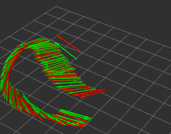
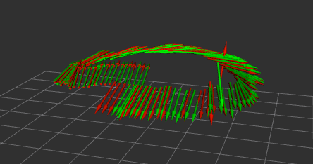
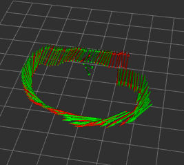
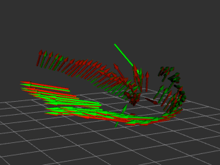

## Proj2 Phase2 Report  Xinjie Yao 20327521

|  |      |
| :------------------------ | ---------------------------- |
|    |  |

#### Analysis of your results 

| Per Frame       | RMSE $x$ | RMSE $y$ | RMSE $z$ | RMSE $roll$ | RMSE $pitch$ | RMSE $yaw$ |
| --------------- | -------- | -------- | -------- | :---------- | ------------ | ---------- |
| Linear solution | 0.236613 | 0.188604 | 0.589393 | 0.122965    | 0.204613     | 0.550431   |

#### Implementations

I follow the pipline of linear 3D-2D pose estimation on planar scene. Since the image is distorted, I first apply `cv::undistortPoints()` to obtain after undistortion and reverse perspective transformation. Since it is guaranteed to be more than 5 pairs of correspondance, I simply stack all pairs of observations to construct the coefficient matrix. To obatin the estimated **$\hat{H}$**, it solves the null space of the coefficient matrix by SVD decomposition, which yields the last column vector of the right singular matrix. As the image points have performed reversed perspective transformation, the intrinsic paramters **$K$** is just an identity matrix. In order to obtain the orthonormal matrix **$R$**,  after using estimated **$\hat{H}$** to construct **$\tilde{H}$** by column stacking first two columns of **$\hat{H}$** with their crossing product, it is the product of left singular matrix and the transpose of right singular matrix. The translation matrix t could be obtained by estimated **$\hat{H}$**.

#### Any other things we should be aware of

- `MDetector.detect()` returns distorted image points, reversing perspective transformation is not enough to recover the image frame. 
- Estimated **$\hat{H}$** may sometimes yields the projection that $t_z$ is negative. Due to the setting of the experiment environment, it is necessary to take those projected points symmetric to the origin, which is amended by mutliplying $-1$. 

