## Proj2 Phase3 Report  Xinjie Yao 20327521

| 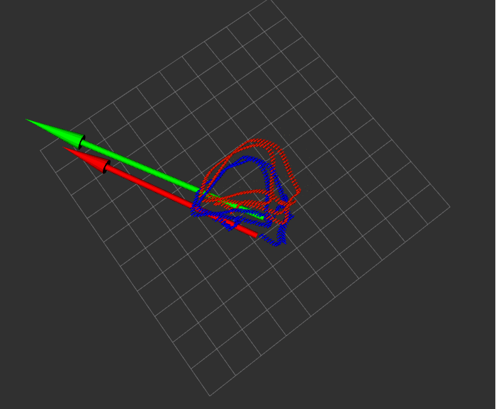 | 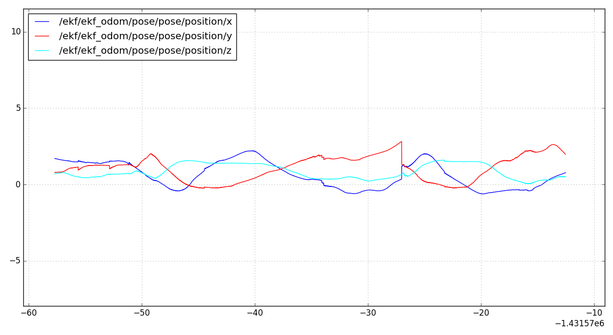 |
| :----------------------------------------------------------- | :-------------------------------------------------------: |
| 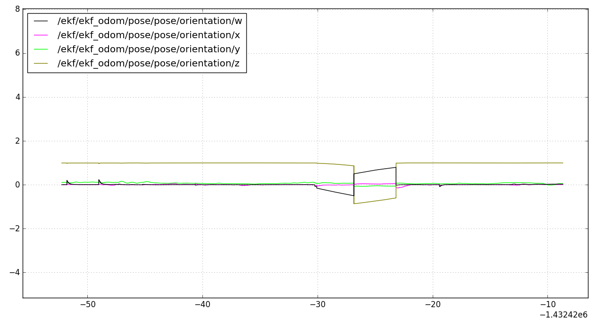    | 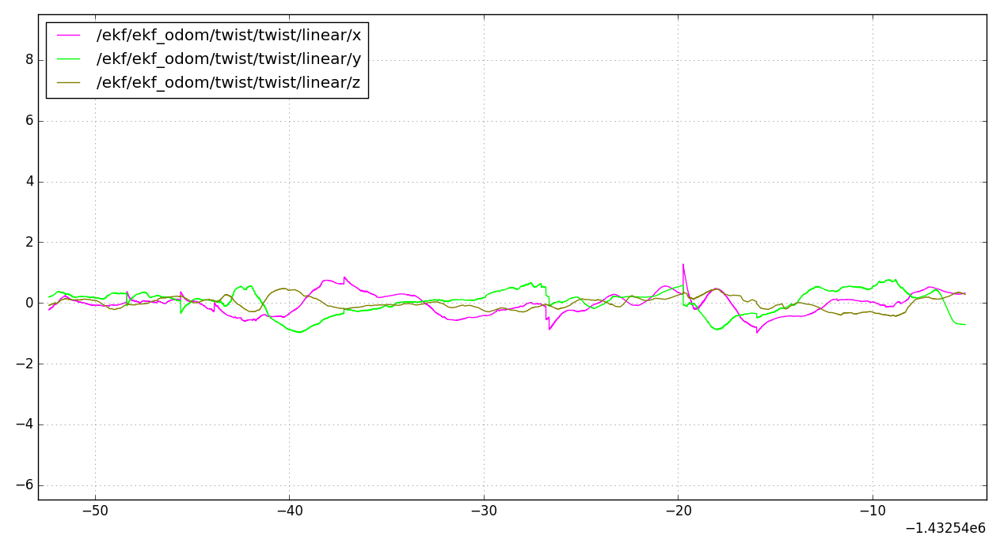 |

| 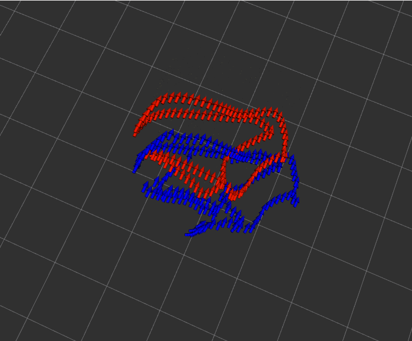 | 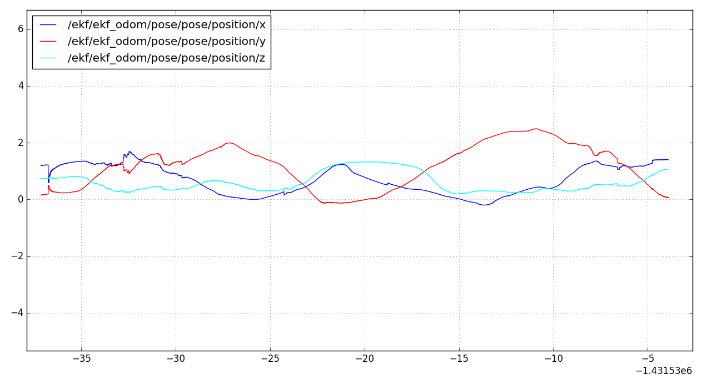 |
| :----------------------------------------------------------- | --------------------------------------------------------- |
| 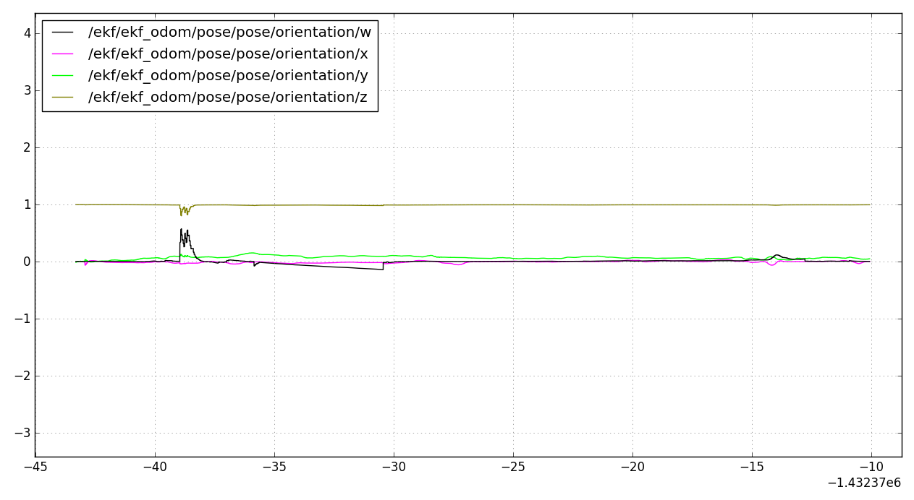    | 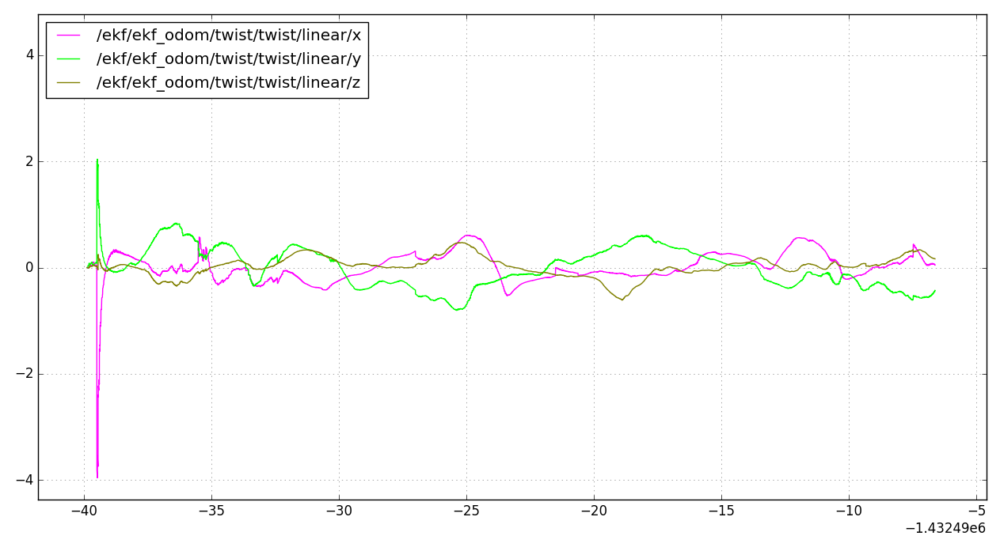 |

| 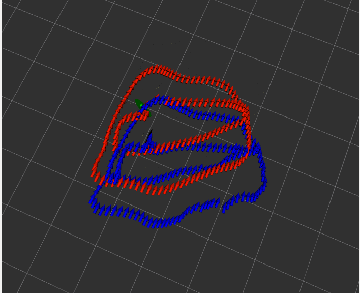 | 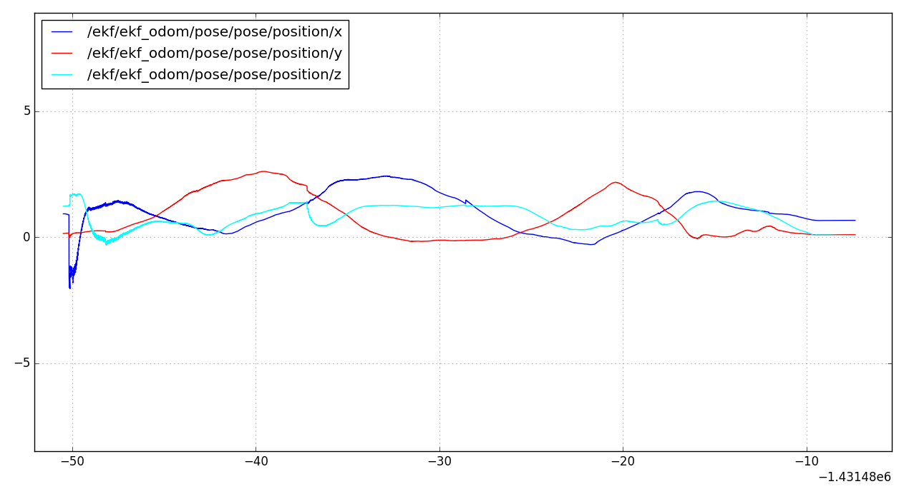 |
| :----------------------------------------------------------- | --------------------------------------------------------- |
| 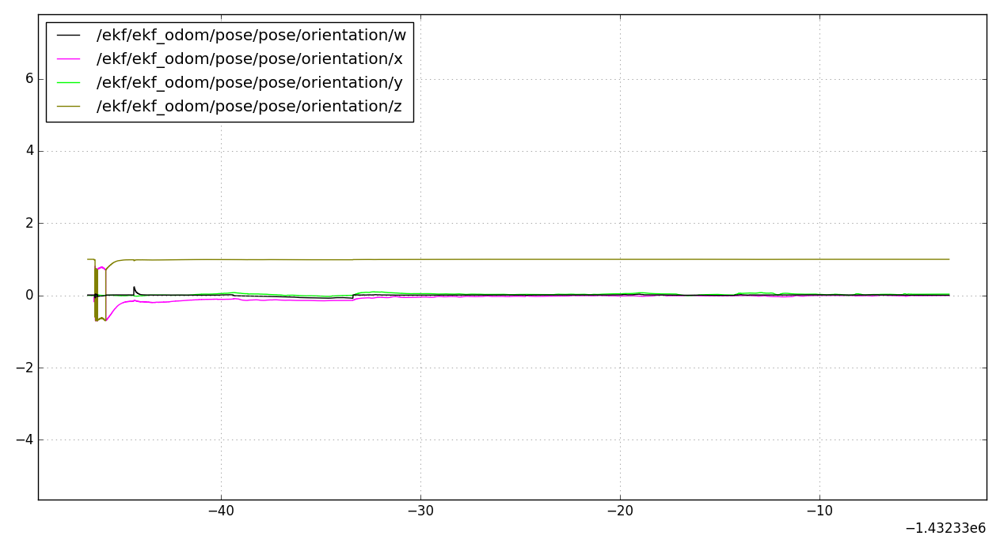    | 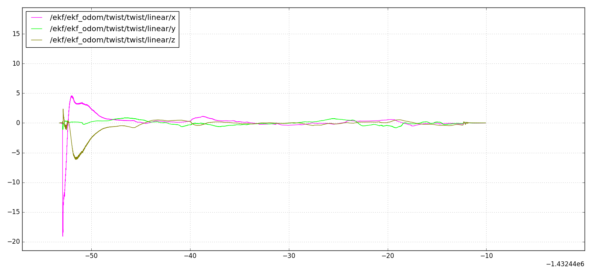 |

Figure 1. Bag1,2,3 in Rviz(blue: ekf_odom, red: gt)(green: gt_vel, red: opticalflow_vel)

#### Implementations

To enable fusion from IMU, PNP and optical flow, each process is put into individual measurement models. IMU callback serves as the prediction step to integrate with respect to time. PNP and optical flow work as the update step. Measurments from PNP is represented by pose( $x$, $y$, $z$)and orientation($phi$,  $theta$, $psi$), and observations from optical flow is represented by $z$, $v_x$,$v_y$. Since the state $x$ is defined in the vicon frame, $z_t$(measurement) from PNP is transformed into vicon frame while $g(\mu_t,0)$ from optical flow is transformed into camera frame.  The Jacobian matrixes are obtained accordingly.   

#### Any other things we should be aware of

- IMU is with respect to its own frame, and state $x$ should ensure to stay in the vicon frame across two measurement models.  PNP update is set to provide initial estimation of x and needs to run before IMU prediction/optical flow update. 
- Covariance $R_t$ from PNP is set to be small comparing to that from optical flow. The odom tends to jump a bit when the tag appears back again to the sole measurement model of optical flow.  
- The number of feature points affects the computing time and the publish/subscribe topic buffer size influences the accuracy of the odom. 
- Notice that in bag 3, the initial estimation is drifted due to the underestimation of the bias in gyro/accel. Since in reality, the initial guess of the sensor bias could be somehow estimated, the covariance matrix is not further tuned. 

